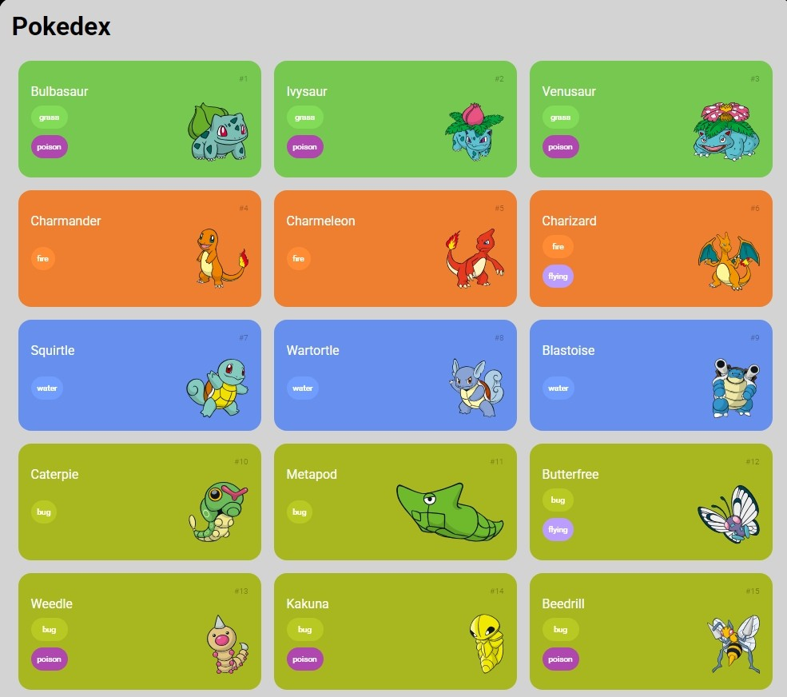

# Pokedex

___

Uma aplicação web responsiva que exibe cards interativos de Pokémons, com informações detalhadas como nome, imagem e tipo. O projeto utiliza a **PokeAPI** para integração de dados, oferecendo uma experiência dinâmica e escalável.

---

## Sobre o Projeto

O **Pokedex** foi desenvolvido com o objetivo de praticar integração com APIs REST e criar uma interface responsiva e amigável. Ele é ideal para fãs de Pokémon e para desenvolvedores que desejam explorar como consumir APIs e manipular grandes volumes de dados de forma eficiente.

---

## Funcionalidades

- **Listagem Inicial:** Exibe 50 cards de Pokémons com informações principais.
- **Carregamento Dinâmico:** Ao clicar no botão "Carregar Mais", novos 50 Pokémons são adicionados à listagem.
- **Design Responsivo:** Layout adaptado para diferentes tamanhos de tela, como desktops, tablets e smartphones.
- **Cards Interativos:** Cada card apresenta o nome, imagem e tipo do Pokémon, utilizando estilos visuais para destacar suas características.

---

## Tecnologias Utilizadas

- **HTML5:** Estruturação semântica da aplicação.
- **CSS3:** Estilização moderna com foco em responsividade.
- **JavaScript:** Lógica de interação e manipulação dinâmica de dados.
- **PokeAPI:** API pública para obter informações dos Pokémons.

---

## Demonstração do Projeto

Confira uma prévia do layout:

---

Feito com :heart: por Tiago Marques.
